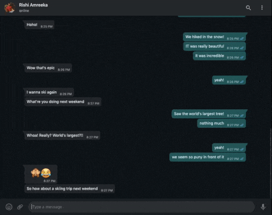
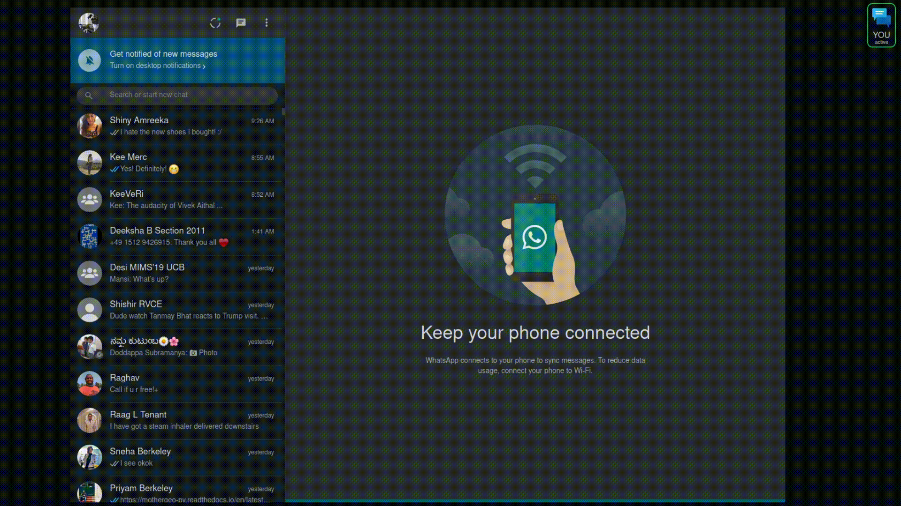
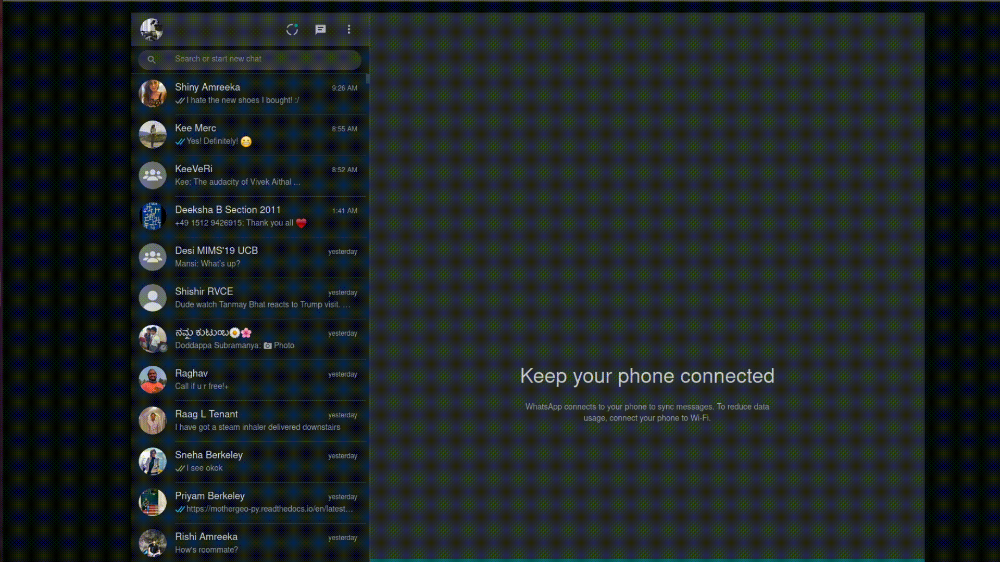

# You   

An auto-completion tool that is you. 

You helps individuals and small businesses improve their responses (speed and quality) to customers! It gives you auto-generated prompts for quick responses. It also gives you sentiment scores for message-threads so that you can focus on the most pressing messages - especially if the same account is used by multiple business owners. Finally, it auto generates calendar invite links so that you can be on top of all upcoming meetings and appointments. 


The best thing? You runs locally and is completely private! You lets you train a generative model that can mimic your personal style, and use it as an autocompletion tool. Currently, You trains on WhatsApp chat history, and offers autocomplete suggestions on WhatsApp Web via a Chrome extension. This can be extended to train and autocomplete on more personal communication apps (Messenger, email, slack, Twitter). **You absolutely do not have to commit to any other expensive and non-private CRM app.**

**Features :**
- Autocomplete/Response Prompts : Powered by DistilGPT2
- Sentiment Tracking : Powered by Expert.ai
- Auto generate calendar invite links : Powered by Expert.ai

Contributors : [nuwandavek](https://twitter.com/nuwandavek), [keerthanpg](https://twitter.com/keerthanpg), [rishicomplex](https://twitter.com/rishicomplex)


## Demo [Autocomplete]

## Demo [Sentiment (ExpertAI sentiment)]

## Demo [Calendar Integration (ExpertAI NER)]


## Getting You set up!
Getting You set up currently needs 4 simple steps : 
1. Train on your Data
2. Install a Chrome/FireFox extension
3. Start the You server
4. Download and start the local Expertai server
4. Use away! 

## Train You on your data

Training You on your own data is somewhat clunky right now. Follow these steps. First, clone the You repository.

```bash
$ git clone https://github.com/nuwandavek/you.git
$ cd you
$ git checkout expertai
$ pip install -r requirements.txt
```


### Fine tune the model on your WhatsApp chat history

First, we'll fine-tune the [DistilGPT2](https://huggingface.co/distilgpt2) model on your WhatsApp history. Follow the instructions in [this colab](https://colab.research.google.com/github/nuwandavek/you/blob/master/Training_You.ipynb). Remember, more the data, the better You work(s)! Download the `model.zip` file at the end of this step, and unzip it to a location of your choice.

### Install the You Browser extension
> *Note : This extension was tested for Firefox and Chrome* 

**Firefox**

- Enter `about:debugging#/runtime/this-firefox` in the address bar
- Click on `Load Temporary Add-on...` 
- Select the manifest.json file in the `extension` folder
- Click on `Reload` for good measure

**Chrome**

- Enter `chrome://extensions/` in the address bar
- Toggle `Developer Mode` (top-right) if you haven't already
- Click on `Load unpacked`
- Select the entire `extension` folder


### Start the You server with your model
Export your expertai username and password (you can create it here, if you have not already: https://developer.expert.ai/ui), then start the server. As the first command line argument, pass the path to the directory containing the model you trained above.

```
export EAI_USERNAME=<your expertai username>                  
export EAI_PASSWORD=<your expoertai password>
python server.py ../Downloads/output
```
### Download and start the Expertai local server
Download the Expertai English local server here (https://developer.expert.ai/ui/resources/edgenlapi/download) and unzip it

```
cd expert.ai.edge_2.1_en
./runmeLinux.sh
```
### Usage
- Once you have the browser extension and the servers working, go to `https://web.whatsapp.com/`. 
- Make sure the extension is working (you should see a logo at the top-right of the screen indicating that the extension is active).
- Now Click on any user you want to chat with, as usual.
- You'll automatically see the sentiment of the messages appear around the picture of the user (and also in the top header).
- If any chat contains a possible time to meet, You automatically extracts all necessary details and created a link for a calendar invite.
- Whenever you want `You` to fill in, press the `tab` key (you can `tab` to get the whole message prompt, or to finish a sentrence you've already started typing.)
- Select one of the 3 prompts (keyboard and mouse supported), or press the `Esc` key to ignore the prompts.
